# InsightForge AI — Database Architecture

Production-grade PostgreSQL schema for multi-tenant B2B SaaS supporting AI, ML, BI, analytics, marketing, sales, and reporting at enterprise scale.

---

## Architecture Overview

| Layer | Technology | Purpose |
|-------|-----------|---------|
| Primary DB | PostgreSQL 15+ | ACID transactions, JSONB, partitioning, RLS |
| Vector Search | pgvector | AI embeddings and semantic retrieval |
| ORM | SQLAlchemy 2.0 | Type-safe models, relationships |
| Migrations | Alembic | Versioned schema evolution |
| Validation | Pydantic v2 | API/input validation |

### Design Principles

- **UUID primary keys** — safe distributed ID generation, no enumeration attacks
- **Multi-tenant isolation** — `organization_id` on every business table
- **Soft deletes** — `deleted_at` preserves audit trail and enables recovery
- **Timestamps** — `created_at`, `updated_at` on all mutable entities
- **Normalized OLTP** — 3NF for transactional domains
- **Denormalized analytics** — `kpi_snapshots`, `dashboard_cache`, materialized views
- **Immutable audit** — `audit_logs`, `login_history`, `access_logs` append-only

---

## Entity Relationship Diagram

```mermaid
erDiagram
    ORGANIZATIONS ||--o{ WORKSPACES : contains
    ORGANIZATIONS ||--o{ ORGANIZATION_MEMBERS : has
    ORGANIZATIONS ||--o{ SUBSCRIPTIONS : billed_via
    ORGANIZATIONS ||--o{ CUSTOMERS : owns
    ORGANIZATIONS ||--o{ CAMPAIGNS : runs
    ORGANIZATIONS ||--o{ DEALS : tracks
    ORGANIZATIONS ||--o{ INTEGRATIONS : connects

    USERS ||--o{ ORGANIZATION_MEMBERS : belongs
    USERS ||--o{ USER_PROFILES : has
    USERS ||--o{ USER_SESSIONS : authenticates
    USERS ||--o{ AI_CONVERSATIONS : chats

    WORKSPACES ||--o{ DEPARTMENTS : contains
    DEPARTMENTS ||--o{ TEAMS : contains
    TEAMS ||--o{ TEAM_MEMBERS : includes

    ROLES ||--o{ ROLE_PERMISSIONS : grants
    PERMISSIONS ||--o{ ROLE_PERMISSIONS : assigned

    CUSTOMERS ||--o{ CUSTOMER_BUSINESS_DETAILS : has
    CUSTOMERS ||--o{ CUSTOMER_ADDRESSES : located_at
    CUSTOMERS ||--o{ CUSTOMER_SCORES : scored_by
    CUSTOMERS ||--o{ CUSTOMER_NOTES : annotated
    CUSTOMERS ||--o{ CUSTOMER_SEGMENT_MEMBERS : in
    CUSTOMERS ||--o{ ORDERS : places
    CUSTOMERS ||--o{ WEB_SESSIONS : browses

    SEGMENTS ||--o{ CUSTOMER_SEGMENT_MEMBERS : contains
    TAGS ||--o{ CUSTOMER_TAGS : labels

    PRODUCTS ||--o{ ORDER_ITEMS : sold_in
    ORDERS ||--o{ ORDER_ITEMS : contains
    ORDERS ||--o{ INVOICES : billed
    INVOICES ||--o{ PAYMENTS : paid_by

    CAMPAIGNS ||--o{ CAMPAIGN_METRICS : measured
    CAMPAIGNS ||--o{ EMAIL_CAMPAIGNS : sends
    AUDIENCES ||--o{ AUDIENCE_MEMBERS : targets

    LEADS ||--o{ LEAD_SCORES : ranked
    LEADS ||--o{ DEALS : converts_to
    DEALS ||--o{ SALES_ACTIVITIES : logged

    AI_CONVERSATIONS ||--o{ AI_MESSAGES : contains
    ML_MODELS ||--o{ ML_MODEL_VERSIONS : versioned
    ML_MODEL_VERSIONS ||--o{ AI_PREDICTIONS : produces
    ML_MODEL_VERSIONS ||--o{ ML_INFERENCE_LOGS : serves

    REPORT_TEMPLATES ||--o{ REPORTS : generates
    REPORTS ||--o{ REPORT_EXPORTS : exports
    REPORTS ||--o{ REPORT_VERSIONS : versions

    INTEGRATIONS ||--o{ INTEGRATION_CREDENTIALS : secures
    INTEGRATIONS ||--o{ SYNC_LOGS : syncs
    INTEGRATIONS ||--o{ WEBHOOK_EVENTS : receives

    FILE_UPLOADS ||--o{ DOCUMENTS : stores
    FILE_UPLOADS ||--o{ REPORTS : attaches
```



### Relationship Summary

| From | To | Cardinality | Cascade | Description |
|------|-----|-------------|---------|-------------|
| Organization | Workspace | 1:N | CASCADE | Tenant partition |
| Organization | Customer | 1:N | CASCADE | All customer data scoped |
| User | OrganizationMember | N:M | CASCADE | Multi-org membership |
| Customer | Order | 1:N | RESTRICT | Prevent orphan revenue |
| Order | OrderItem | 1:N | CASCADE | Line items |
| Campaign | CampaignMetric | 1:N | CASCADE | Daily rollups |
| Deal | SalesActivity | 1:N | CASCADE | CRM timeline |
| AIConversation | AIMessage | 1:N | CASCADE | Chat history |
| MLModelVersion | AIPrediction | 1:N | RESTRICT | Model lineage |
| Integration | SyncLog | 1:N | CASCADE | ETL audit |

---

## Schema Statistics

| Domain | Tables | Primary Module |
|--------|--------|----------------|
| Multi-Tenant | 18 | `authentication/`, `admin/` |
| User Management | 11 | `authentication/` |
| Customer 360 | 16 | `pages/06_Customer_Profile.py`, `analytics/customer/` |
| Commerce | 14 | `sales/`, `data_engine/` |
| Behavior | 10 | `analytics/`, integrations (GA) |
| Marketing | 12 | `marketing/`, `pages/16_Marketing.py` |
| Sales | 9 | `sales/`, `pages/17_Sales.py` |
| Support | 10 | Future support module |
| AI | 14 | `ai/`, `pages/09_AI_Center.py` |
| ML | 10 | `ml_models/` |
| Analytics | 5 | `analytics/`, dashboard cache |
| Reporting | 6 | `reporting/`, `pages/20_Reports.py` |
| Notifications | 4 | Settings, admin |
| Integrations | 4 | `integrations/`, `pages/19_Integrations.py` |
| Security | 7 | `security/`, `admin/` |
| Files | 6 | `data/`, `pages/18_Data_Manager.py` |
| System | 7 | `admin/`, `utils/` |
| **Total** | **~113** | |

---

## Complete Table Catalog

Each table includes: **Purpose**, **Key Columns**, **Constraints**, **Indexes**, **Validation**, **Example**.

### MULTI-TENANT

#### `organizations`
| Attribute | Detail |
|-----------|--------|
| **Purpose** | Root SaaS tenant; all business data scoped here |
| **Columns** | `id UUID PK`, `name VARCHAR(255)`, `slug VARCHAR(100) UNIQUE`, `status ENUM`, `industry`, `timezone`, `locale`, `metadata JSONB`, `created_at`, `updated_at`, `deleted_at` |
| **Constraints** | `slug` unique, `status` check enum |
| **Indexes** | `ix_organizations_slug`, `ix_organizations_status` |
| **Validation** | Slug: lowercase alphanumeric + hyphens |
| **Example** | `{name: "Acme Corp", slug: "acme-corp", status: "active"}` |
| **Used by** | All modules, session context |

#### `workspaces`
| **Purpose** | Logical environments (Production, Staging) within org |
| **Columns** | `organization_id FK`, `name`, `slug`, `is_default` |
| **Constraints** | `UNIQUE(organization_id, slug)` |
| **Example** | `{name: "Production", slug: "prod", is_default: true}` |

#### `departments` / `teams` / `team_members`
| **Purpose** | Org hierarchy for RBAC and reporting |
| **Relationships** | Workspace → Department → Team → User |

#### `roles` / `permissions` / `role_permissions` / `user_roles`
| **Purpose** | RBAC — role-based access control |
| **Example permission** | `{code: "customers.read", module: "customers"}` |

#### `organization_members`
| **Purpose** | Links users to organizations with ownership flag |
| **Constraints** | `UNIQUE(organization_id, user_id)` |

#### `invitations`
| **Purpose** | Pending user invites with expiring tokens |
| **Validation** | Token hash only stored; plaintext never persisted |

#### `subscriptions` / `subscription_plans` / `billing_accounts`
| **Purpose** | SaaS billing and plan limits |
| **Example plan** | `{name: "Enterprise", tier: "enterprise", max_customers: 1000000}` |

#### `api_keys` / `feature_flags` / `organization_feature_flags`
| **Purpose** | Programmatic access and feature toggles |

---

### USER MANAGEMENT

#### `users`
| **Purpose** | Platform identity (cross-tenant) |
| **Columns** | `email UNIQUE`, `password_hash`, `status`, `email_verified_at`, `last_login_at` |
| **Indexes** | `ix_users_email`, `ix_users_status` |
| **Example** | `{email: "alex@acme.com", status: "active"}` |

#### `user_profiles`
| **Purpose** | Display name, avatar, job title |
| **Relationship** | 1:1 with `users` |

#### `user_sessions` / `login_history`
| **Purpose** | Session management and login audit |
| **Validation** | Store `token_hash`, never raw tokens |

#### `oauth_accounts` / `password_reset_tokens` / `two_factor_auth`
| **Purpose** | SSO, password recovery, 2FA |

#### `user_preferences` / `user_activities` / `notification_settings`
| **Purpose** | UX preferences and activity feed |

---

### CUSTOMER 360

#### `customers`
| **Purpose** | Core customer entity — anchor for 360° view |
| **Columns** | `organization_id FK`, `email`, `full_name`, `status`, `lead_status`, `lifecycle_stage`, `owner_id FK`, `external_id`, `metadata JSONB` |
| **Constraints** | `UNIQUE(organization_id, external_id)` |
| **Indexes** | `(organization_id, status, lifecycle_stage)`, partial index on active |
| **Example** | `{full_name: "Jordan Chen", lifecycle_stage: "customer", status: "active"}` |
| **Used by** | Dashboard, Customer pages, AI, ML |

#### `customer_business_details`
| **Purpose** | B2B firmographics (company, industry, ARR) |

#### `customer_addresses`
| **Purpose** | Geo data with lat/lon for maps |
| **Example** | `{city: "San Francisco", country_code: "US", lat: 37.7749}` |

#### `customer_scores`
| **Purpose** | Health, engagement, CLV, churn scores |
| **Constraints** | `UNIQUE(customer_id, score_type)` |
| **Validation** | Scores 0–100 for health/engagement/churn |
| **Example** | `{score_type: "health", value: 82.4, model_version: "v2.1"}` |

#### `segments` / `customer_segment_members`
| **Purpose** | Static/dynamic segmentation for campaigns |

#### `tags` / `customer_tags`
| **Purpose** | Flexible labeling |

#### `customer_notes` / `customer_attachments` / `customer_ai_summaries`
| **Purpose** | CRM notes, files, AI-generated summaries |

#### `customer_lifecycle_events`
| **Purpose** | Stage transition audit (lead → customer → advocate) |

---

### COMMERCE

#### `products` / `product_categories`
| **Purpose** | Product catalog |
| **Constraints** | `UNIQUE(organization_id, sku)` |

#### `orders` / `order_items`
| **Purpose** | Transaction records |
| **Indexes** | `(organization_id, placed_at)` for revenue queries |
| **Example order** | `{order_number: "ORD-10001", total: 48000.00, status: "paid"}` |

#### `invoices` / `invoice_items` / `payments` / `refunds`
| **Purpose** | Billing lifecycle |

#### `customer_subscriptions` / `coupons` / `tax_rates` / `shipping_records`
| **Purpose** | Recurring revenue, discounts, tax, fulfillment |

---

### CUSTOMER BEHAVIOR

#### `web_sessions`
| **Purpose** | Visit sessions with UTM attribution |
| **Columns** | `session_key`, `device_type`, `browser`, `utm_source`, `bounced` |
| **Scale note** | Partition by `started_at` monthly at 10M+ rows |

#### `page_views` / `click_events` / `scroll_events` / `search_events`
| **Purpose** | Granular web analytics |
| **Indexes** | `(organization_id, viewed_at)` |

#### `customer_events`
| **Purpose** | Generic event stream (product analytics) |
| **Example** | `{event_name: "feature_used", properties: {feature: "ai_query"}}` |

#### `funnels` / `funnel_steps` / `customer_journeys` / `journey_touchpoints`
| **Purpose** | Conversion analysis and journey mapping |

---

### MARKETING

#### `campaigns`
| **Purpose** | Campaign master across channels |
| **Example** | `{name: "Q2 Launch", channel: "email", status: "running"}` |

#### `audiences` / `audience_members`
| **Purpose** | Target lists linked to segments |

#### `email_campaigns` / `sms_campaigns` / `whatsapp_campaigns` / `push_campaigns`
| **Purpose** | Channel-specific campaign content |

#### `campaign_metrics`
| **Purpose** | Daily CTR, conversions, ROI rollups (denormalized) |
| **Example** | `{sent: 42000, opened: 18900, roi: 3.2}` |

#### `ab_tests` / `ab_test_variants`
| **Purpose** | Experimentation framework |

#### `attribution_models` / `attribution_events`
| **Purpose** | Multi-touch attribution |

---

### SALES

#### `leads` / `lead_sources` / `lead_scores`
| **Purpose** | Lead management and scoring |

#### `deals` / `pipeline_stages`
| **Purpose** | Opportunity pipeline |
| **Example** | `{name: "Enterprise Suite", amount: 124000, stage: "negotiation"}` |

#### `sales_activities` / `sales_tasks` / `meetings` / `sales_forecasts`
| **Purpose** | CRM activity tracking and forecasting |

---

### SUPPORT

#### `support_tickets` / `ticket_messages`
| **Purpose** | Help desk with SLA tracking |

#### `live_chats` / `chat_messages`
| **Purpose** | Real-time support |

#### `knowledge_base_articles`
| **Purpose** | Self-service docs |

#### `feedback` / `ratings` / `reviews` / `csat_responses` / `nps_responses`
| **Purpose** | Voice of customer metrics |

---

### AI

#### `ai_conversations` / `ai_messages`
| **Purpose** | Chat history for AI Center |
| **Used by** | `pages/09_AI_Center.py`, `ai/chatbot/` |

#### `prompt_history` / `prompt_templates`
| **Purpose** | Prompt audit and reusable templates |

#### `embeddings` / `vector_metadata` / `knowledge_base_documents`
| **Purpose** | RAG pipeline with pgvector |
| **Scale note** | HNSW index on embedding column (migration 003) |

#### `ai_insights` / `ai_recommendations` / `ai_predictions` / `ai_forecasts`
| **Purpose** | AI-generated business intelligence |

#### `ai_reports` / `ai_explanations`
| **Purpose** | Narrative reports and explainability (SHAP, LIME) |

#### `ml_model_versions`
| **Purpose** | Model registry with deployment status |

---

### MACHINE LEARNING

#### `ml_models` / `ml_experiments` / `ml_training_datasets`
| **Purpose** | Experiment tracking and dataset registry |

#### `ml_inference_logs` / `ml_prediction_results`
| **Purpose** | Production inference audit |

#### `feature_store_entries` / `feature_metadata`
| **Purpose** | Feature store for real-time scoring |

#### `ml_evaluation_metrics` / `model_monitoring_metrics` / `drift_detection_logs`
| **Purpose** | Model quality and drift monitoring |

---

### ANALYTICS (Denormalized)

#### `kpi_snapshots`
| **Purpose** | Pre-computed KPIs for dashboard (avoid heavy joins) |
| **Example** | `{category: "revenue", metric_name: "mrr", value: 2400000}` |

#### `dashboard_cache`
| **Purpose** | Widget-level cache with TTL |

#### `analytics_aggregations` / `analytics_snapshots`
| **Purpose** | Periodic rollups for BI queries |

#### `materialized_view_refresh_log`
| **Purpose** | MV refresh job tracking |

---

### REPORTING

#### `report_templates` / `reports` / `scheduled_reports`
| **Purpose** | Report library and scheduling |
| **Used by** | `reporting/`, `pages/20_Reports.py` |

#### `report_exports` / `report_shares` / `report_versions`
| **Purpose** | Export jobs, sharing, version history |

---

### INTEGRATIONS

#### `integrations`
| **Purpose** | Connected platforms (Salesforce, Shopify, etc.) |
| **Providers** | salesforce, hubspot, shopify, stripe, google_analytics, zoho |

#### `integration_credentials`
| **Purpose** | Encrypted OAuth tokens and API keys |

#### `webhook_events` / `sync_logs`
| **Purpose** | Inbound webhooks and ETL sync audit |

---

### SECURITY

#### `audit_logs`
| **Purpose** | Immutable compliance audit (SOC2, GDPR) |
| **Columns** | `action`, `entity_type`, `entity_id`, `old_values`, `new_values` |
| **Scale note** | Partition by month; archive to cold storage after 2 years |

#### `access_logs` / `permission_logs` / `security_events`
| **Purpose** | API access, permission changes, incidents |

#### `api_tokens` / `refresh_tokens` / `encryption_metadata`
| **Purpose** | Token management and field-level encryption keys |

---

### FILES

#### `file_uploads`
| **Purpose** | Central file registry (S3/local) |
| **Columns** | `storage_path`, `mime_type`, `size_bytes`, `checksum`, `category` |

#### `documents` / `images` / `ai_files` / `temp_files` / `file_exports`
| **Purpose** | Typed file references |

---

### SYSTEM

#### `app_settings` / `organization_settings`
| **Purpose** | Key-value configuration |

#### `currencies` / `countries` / `languages` / `themes`
| **Purpose** | Reference data |

#### `system_logs`
| **Purpose** | Application-level logging |

---

## SQLAlchemy Structure

```
database/
├── base.py              # Base, mixins (UUID, Timestamp, SoftDelete, Tenant)
├── enums.py             # 30+ domain enums
├── connection.py        # DatabaseConfig from env
├── session.py           # Engine, SessionLocal, get_session()
├── seed.py              # Reference data seeder
├── models/
│   ├── tenant.py        # Organization, Workspace, RBAC, Billing
│   ├── auth.py          # Users, Sessions, OAuth, 2FA
│   ├── customer.py      # Customer 360
│   ├── commerce.py      # Orders, Invoices, Products
│   ├── behavior.py      # Web analytics, Events
│   ├── marketing.py     # Campaigns, A/B tests
│   ├── sales.py         # Leads, Deals, Pipeline
│   ├── support.py       # Tickets, CSAT, NPS
│   ├── ai.py            # Conversations, Insights, Embeddings
│   ├── ml.py            # Models, Features, Drift
│   ├── analytics.py     # KPI snapshots, Cache
│   ├── reporting.py     # Reports, Schedules
│   ├── notifications.py # Alerts, Templates
│   ├── integrations.py  # CRM, E-commerce connectors
│   ├── security.py      # Audit, Tokens
│   ├── files.py         # Upload registry
│   └── system.py        # Reference data, Settings
└── schemas/
    └── __init__.py      # Pydantic validation schemas
```

### Mixins

| Mixin | Fields | Usage |
|-------|--------|-------|
| `UUIDPrimaryKeyMixin` | `id UUID` | All tables |
| `TimestampMixin` | `created_at`, `updated_at` | Mutable entities |
| `SoftDeleteMixin` | `deleted_at` | Recoverable deletes |
| `TenantMixin` | `organization_id FK` | All business data |
| `WorkspaceScopedMixin` | `workspace_id FK` | Optional workspace scope |

---

## Alembic Migration Plan

| Revision | Description |
|----------|-------------|
| **001** | Extensions (uuid-ossp, pgvector) + full schema + composite indexes |
| **002** | Seed reference data (currencies, countries, plans, permissions) |
| **003** | Materialized views: `mv_daily_revenue`, `mv_customer_health`, `mv_campaign_roi` |
| **004** | Table partitioning: `page_views`, `customer_events`, `audit_logs` by month |
| **005** | Row-Level Security policies: `organization_id = current_setting('app.current_org')` |
| **006** | pgvector HNSW index on embeddings; GIN indexes on JSONB metadata |
| **007** | Read replicas routing views for analytics workloads |

### Commands

```bash
# Apply migrations
alembic upgrade head

# Generate new migration after model changes
alembic revision --autogenerate -m "describe change"

# Seed reference data
python -m database.seed
```

---

## Scalability Strategy

### Horizontal Scale
- **Read replicas** for analytics queries and report generation
- **Connection pooling** via PgBouncer (transaction mode)
- **Tenant sharding** option: hash(`organization_id`) → dedicated schema at 10K+ tenants

### High-Volume Tables
| Table | Strategy |
|-------|----------|
| `page_views`, `click_events` | Monthly partitioning + 90-day hot retention |
| `customer_events` | Partition by `occurred_at`; archive to S3/Parquet |
| `audit_logs` | Append-only partition; compliance archive |
| `ml_inference_logs` | 30-day TTL with aggregate rollups |

### Analytics Performance
- **Materialized views** refreshed every 15 minutes for dashboards
- **`kpi_snapshots`** written by batch jobs (avoid real-time aggregation)
- **`dashboard_cache`** with Redis-backed TTL (DB fallback)
- **Composite indexes** on `(organization_id, date_column)` for all time-series queries

### Multi-Tenant Isolation
- Application layer: always filter by `organization_id`
- Database layer: PostgreSQL RLS (migration 005)
- API layer: JWT claim `org_id` validated against request scope

---

## Environment Variables

```env
DB_HOST=localhost
DB_PORT=5432
DB_NAME=insightforge
DB_USER=insightforge
DB_PASSWORD=<secret>
DATABASE_URL=postgresql+psycopg2://insightforge:<secret>@localhost:5432/insightforge
DB_POOL_SIZE=20
DB_MAX_OVERFLOW=40
```

---

## Module → Table Mapping

| Application Module | Primary Tables |
|-------------------|----------------|
| `pages/04_Dashboard.py` | `kpi_snapshots`, `dashboard_cache`, `analytics_aggregations` |
| `pages/06_Customer_Profile.py` | `customers`, `customer_scores`, `customer_notes` |
| `pages/09_AI_Center.py` | `ai_conversations`, `ai_messages`, `ai_insights` |
| `pages/12_Predictions.py` | `ai_predictions`, `ml_prediction_results` |
| `pages/16_Marketing.py` | `campaigns`, `campaign_metrics`, `ab_tests` |
| `pages/17_Sales.py` | `deals`, `sales_activities`, `sales_forecasts` |
| `pages/18_Data_Manager.py` | `file_uploads`, `ml_training_datasets` |
| `pages/19_Integrations.py` | `integrations`, `sync_logs` |
| `pages/20_Reports.py` | `reports`, `scheduled_reports`, `report_exports` |
| `pages/21_Admin.py` | `users`, `roles`, `audit_logs`, `feature_flags` |
| `ml_models/` | `ml_models`, `ml_experiments`, `feature_store_entries` |
| `ai/` | `embeddings`, `prompt_templates`, `ai_recommendations` |

---

*InsightForge AI Database Architecture v1.0 — Production Ready*
